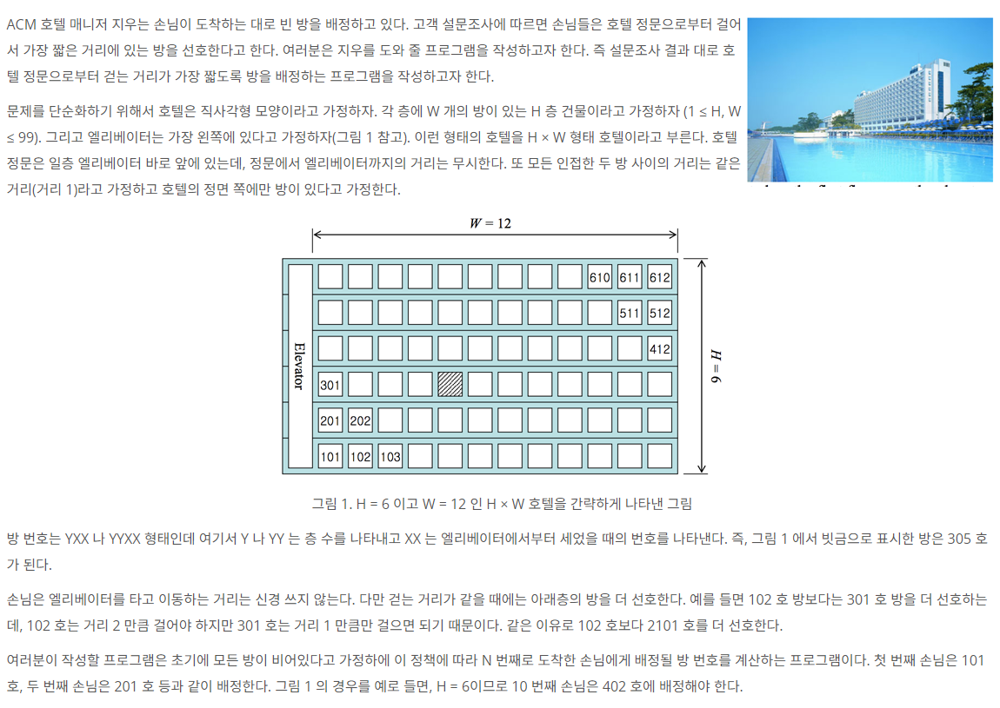

<h1> [10250] ACM 호텔 </h1>

<a href="https://www.acmicpc.net/problem/10250 " target="_black">``문제 보기``</a>


<h3>Question</h3>



<br>

<h4>Input</h4>

```bash
프로그램은 표준 입력에서 입력 데이터를 받는다.
프로그램의 입력은 T 개의 테스트 데이터로 이루어져 있는데 T 는 입력의 맨 첫 줄에 주어진다.
각 테스트 데이터는 한 행으로서 H, W, N, 세 정수를 포함하고 있으며
각각 호텔의 층 수, 각 층의 방 수, 몇 번째 손님인지를 나타낸다(1 ≤ H, W ≤ 99, 1 ≤ N ≤ H × W)
```

<h4>Output</h4>

```bash
프로그램은 표준 출력에 출력한다. 각 테스트 데이터마다 정확히 한 행을 출력하는데,
내용은 N 번째 손님에게 배정되어야 하는 방 번호를 출력한다.
```

<br><br>

<hr>

<br>

<h3>Answer</h3>


💡JAVA printf() 출력 서식<br>
&nbsp; &nbsp; &nbsp; %d : 정수 형식으로 출력<br>
&nbsp; &nbsp; &nbsp; %02d : 자리수를 2자리로 지정하고 빈 자리는 0으로 채워 정수 형식으로 출력

💡고려 사항<br>
&nbsp; &nbsp; &nbsp; 만약 H(층 수)가 6이고 N(몇 번째 손님)이 6인 경우 601호를 배정받아야 되는데 <br>
&nbsp; &nbsp; &nbsp; Y = N % H , X = N / H + 1로 하면 올바른 답이 나오지 않는다.<br>
&nbsp; &nbsp; &nbsp; ① N % H == 0인 경우에 Y는 N % H가 아닌 H로 해준다.<br>
&nbsp; &nbsp; &nbsp; ② X도 마찬가지로 N % H == 0인 경우에 N / H + 1의 값이 아닌 N / H로 해줌

<br>

```java
import java.io.BufferedReader;
import java.io.InputStreamReader;
import java.util.StringTokenizer;

public class Main {
    public static void main(String[] args) throws Exception{
        BufferedReader br = new BufferedReader(new InputStreamReader(System.in));
        int loopCount = Integer.parseInt(br.readLine());
        for(int i = 0 ; i<loopCount;i++){
            StringTokenizer st = new StringTokenizer(br.readLine());
            int H = Integer.parseInt(st.nextToken());   // 층 수
            int W = Integer.parseInt(st.nextToken());   // 각 층의 방 수
            int N = Integer.parseInt(st.nextToken());   // 몇 번째 손님

            int Y = N % H == 0 ? H : N % H;
            int X = N % H == 0 ? N / H : N / H + 1;
            System.out.printf("%d%02d%n",  Y, X);   // 형식에 맞춰 출력
        }
    }
}
```

<br>

<h3>Result</h3>

|메모리(KB)| 시간(ms)|
|:---:|:---:|
|12300|128|
