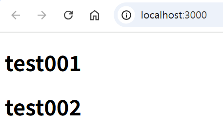
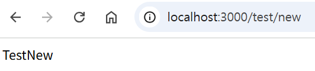

## 리액트 프로젝트 생성 후 Node.js + DB 연동  

**블로그 링크**  

[React 프로젝트 생성](https://d0u0b.tistory.com/entry/React-React%EC%83%9D%EC%84%B1%EB%B6%80%ED%84%B0-Nodejs-%EC%97%B0%EB%8F%99%EA%B9%8C%EC%A7%80-1-React-%ED%94%84%EB%A1%9C%EC%A0%9D%ED%8A%B8-%EC%83%9D%EC%84%B1)  
[Import 경로 설정](https://d0u0b.tistory.com/entry/React-React%EC%83%9D%EC%84%B1%EB%B6%80%ED%84%B0-Nodejs-%EC%97%B0%EB%8F%99%EA%B9%8C%EC%A7%80-2-%08%ED%94%84%EB%A1%9C%EC%A0%9D%ED%8A%B8-Import-%EA%B2%BD%EB%A1%9C-%EC%84%A4%EC%A0%95)  
[Router 설정](https://d0u0b.tistory.com/entry/React-React%EC%83%9D%EC%84%B1%EB%B6%80%ED%84%B0-Nodejs-%EC%97%B0%EB%8F%99%EA%B9%8C%EC%A7%80-3-%08Router-%EC%84%A4%EC%A0%95)  
[Node.js 연동](https://d0u0b.tistory.com/entry/React-React%EC%83%9D%EC%84%B1%EB%B6%80%ED%84%B0-Nodejs-%EC%97%B0%EB%8F%99%EA%B9%8C%EC%A7%80-4-Nodejs-%EC%97%B0%EB%8F%99)  
[DB 연동](https://d0u0b.tistory.com/entry/React-React%EC%83%9D%EC%84%B1%EB%B6%80%ED%84%B0-Nodejs-%EC%97%B0%EB%8F%99%EA%B9%8C%EC%A7%80-5-DB-%EC%97%B0%EB%8F%99)  

## 📒 기술스택

     

## 화면 구성 📺
  

|                /                  |            /test/new          |
|:---------------------------------------:|:---------------------------------------:|
|      |    |